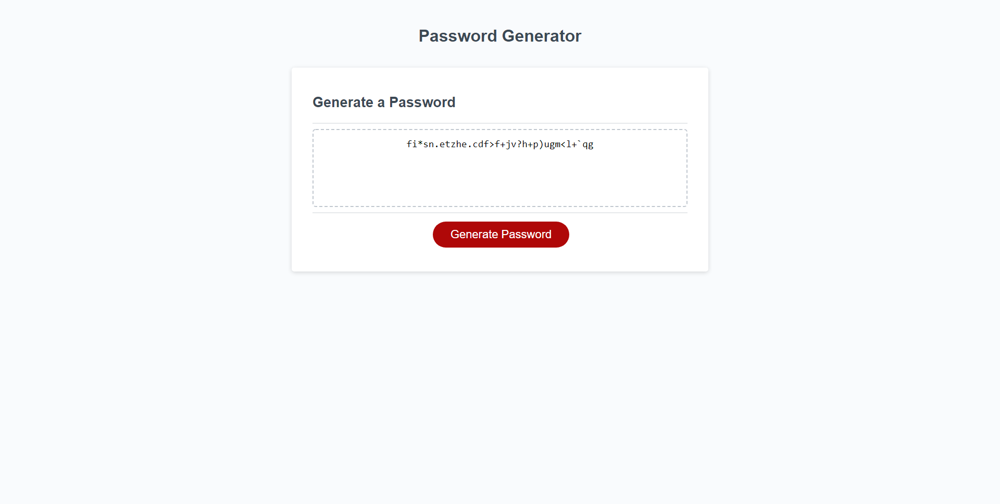

# Password_Generator
Creating Passwords with JavaScript 
We wanted to create a password generator to help with the process of reseting out password every 3 months
This will help all employees with not having to come up with a new password. Now they can just generate a new password when need be and run LastPass to keep track of it. 
    ```md
    
    ```
## Tests
tested all possible combinations with a password, had a small bug with multiple sessions stacking on one another but it was fixed.
